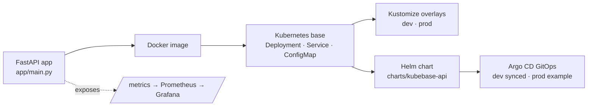

# KubeBase Platform

[](https://github.com/Carrasco515/kubebase-platform/actions/workflows/ci.yml)


[](LICENSE)

> A DevOps **learning and portfolio project** — a local Kubernetes platform lab.
> It runs a small FastAPI demo app on Kubernetes with clean, beginner-friendly
> manifests, Kustomize and GitHub Actions CI.

**KubeBase Platform** is where I practise running and operating an application on
**Kubernetes**. A simple FastAPI service is packaged as a container image and
deployed with plain Kubernetes manifests organised through **Kustomize** — a
Deployment with health probes and resource limits, a Service, a ConfigMap for
non-secret configuration and an example Secret to show the pattern. Everything is
designed to run on a **local cluster** (minikube, kind or Docker Desktop) and is
validated by a read-only CI pipeline.

> **For recruiters & reviewers:** This is a hands-on learning project that takes
> one small app through a realistic delivery chain — **Docker → Kubernetes →
> Kustomize → Helm → GitOps (Argo CD) → observability** — with read-only CI and
> documentation at each step. It runs entirely on a local cluster, uses no real
> secrets, and keeps "prod" as a clearly-labelled local example. It shows
> *junior-level DevOps / Platform Engineering* fundamentals end to end, not a
> production system.

## Why I built it

After building [CloudBase Lab](https://github.com/Carrasco515/cloudbase-lab) — my
Docker Compose homelab — I wanted to take the next step and learn **Kubernetes**
properly. KubeBase Platform is my hands-on way to understand how an app moves from
a container into a cluster: namespaces, Deployments, Services, configuration,
health probes, resource limits and a clean manifest layout I can grow over time.

## DevOps skills demonstrated

- **Containerization** — small, non-root Dockerfile on `python:3.12-slim`.
- **Kubernetes manifests** — Namespace, Deployment (readiness + liveness probes,
  resource requests/limits), Service and ConfigMap.
- **Kustomize overlays** — a shared `base` with `dev` / `prod` overlays that patch
  config and replica counts without duplication.
- **Helm packaging** — the same app as a templated chart with `values-dev.yaml` /
  `values-prod.yaml` profiles.
- **GitOps with Argo CD** — `Application` manifests; the dev Application was
  reconciled locally to **Synced & Healthy** (prod left as example-only).
- **Testing** — pytest smoke tests for every endpoint (`app/test_main.py`),
  run automatically in CI.
- **CI validation** — read-only GitHub Actions: Python compile, pytest,
  Kustomize build, Helm lint/template, GitOps + observability checks.
  No deployment, no cluster.
- **Observability** — a Prometheus-style `/metrics` endpoint, pod scrape
  annotations and a Grafana starter dashboard.
- **Operations documentation** — runbook-style docs for build, deploy, inspect
  and safe cleanup.
- **Security hygiene & safe defaults** — runs as non-root, no real secrets in Git,
  manual GitOps sync, and "prod" kept as a clearly-labelled local example.

## Tech stack

| Area | Tools |
|---|---|
| App | Python, FastAPI, uvicorn |
| Container | Docker |
| Orchestration | Kubernetes (local: Minikube / kind / Docker Desktop) |
| Config / templating | Kustomize, Helm |
| GitOps | Argo CD |
| Observability | Prometheus client (`/metrics`), Grafana (dashboard JSON) |
| CI | GitHub Actions (read-only validation) |

## How it complements CloudBase Lab

| | CloudBase Lab | KubeBase Platform |
|---|---|---|
| Orchestration | Docker Compose | Kubernetes |
| Focus | Self-hosted homelab stack | Platform / app-on-Kubernetes lab |
| Config & secrets | `.env` files | ConfigMap + Secret |
| Packaging / delivery | Compose file | Kustomize → Helm → Argo CD GitOps |
| Observability | container logs | logs + Prometheus `/metrics` |

CloudBase Lab shows I can run a real multi-service stack; KubeBase Platform shows
I'm building the **Kubernetes and Platform Engineering** skills on top of that.

## Project layout

```
kubebase-platform/
├── app/                     # FastAPI demo application
│   ├── main.py
│   ├── test_main.py         # pytest smoke tests (run in CI)
│   └── requirements.txt     # + requirements-dev.txt for tests
├── Dockerfile               # Container image for the app
├── kubernetes/
│   ├── base/                # Kustomize base manifests
│   │   ├── namespace.yaml
│   │   ├── deployment.yaml
│   │   ├── service.yaml
│   │   ├── configmap.yaml
│   │   ├── secret.example.yaml  # example only — not applied by default
│   │   └── kustomization.yaml
│   └── overlays/            # Per-environment overlays (patches on the base)
│       ├── dev/             # local Minikube — namespace kubebase-dev
│       └── prod/            # local learning "prod" — namespace kubebase-prod
├── charts/kubebase-api/     # Helm chart (packaging/templating path)
│   ├── Chart.yaml
│   ├── values.yaml          # + values-dev.yaml / values-prod.yaml
│   └── templates/
├── gitops/                  # GitOps (Argo CD) examples
│   ├── README.md
│   └── argocd/              # Argo CD Application manifests (dev + prod example)
├── observability/
│   └── grafana/            # Grafana starter dashboard (JSON)
├── docs/                    # architecture, operations, gitops, observability
│   └── images/             # screenshots (optional — add your own)
└── .github/workflows/ci.yml # Read-only validation
```

## Architecture



The app is built once and delivered through progressively higher-level tooling:
raw Kubernetes manifests, then Kustomize overlays, then a Helm chart, then GitOps
with Argo CD — with a Prometheus-style `/metrics` endpoint for observability. See
[`docs/architecture.md`](docs/architecture.md) for the full breakdown.

## The app

A minimal FastAPI service with three endpoints:

| Endpoint  | Purpose |
|-----------|---------|
| `GET /`        | Welcome message + basic app info |
| `GET /health`  | Health check (used by the liveness/readiness probes) |
| `GET /config`  | Shows the non-secret configuration the app was started with |
| `GET /metrics` | Prometheus-format metrics (Phase 5 observability) |

Configuration (`APP_NAME`, `APP_ENV`, `APP_GREETING`, `LOG_LEVEL`) is read from
environment variables, which in the cluster come from the **ConfigMap**.

## Run the app locally (without Kubernetes)

```bash
cd app
python -m venv .venv && source .venv/bin/activate
pip install -r requirements.txt
uvicorn main:app --reload --port 8000
# then open http://localhost:8000/ , /health , /config
```

Run the tests (same as CI):

```bash
pip install -r requirements-dev.txt
pytest -q
```

## Build the Docker image

```bash
docker build -t kubebase-platform:0.1.0 .
docker run --rm -p 8000:8000 kubebase-platform:0.1.0
```

## Deploy to local Kubernetes

> ⚠️ This applies resources to whatever cluster your `kubectl` context points at.
> Make sure it's a **local** cluster first (`kubectl config current-context`).

The project uses **Kustomize** with a shared `base` and two overlays:

| Target | Namespace | Replicas | Use |
|---|---|---|---|
| `base` | `kubebase-dev` | 2 | The shared manifests (also usable directly) |
| `overlays/dev` | `kubebase-dev` | 2 | Local development on Minikube |
| `overlays/prod` | `kubebase-prod` | 3 | A **local learning** "prod" — *not* a real production cluster |

```bash
# 1. Make the image available to your local cluster, e.g.:
minikube image load kubebase-platform:0.1.0      # minikube
# or: kind load docker-image kubebase-platform:0.1.0   # kind

# 2. Preview the rendered manifests (no changes made):
kubectl kustomize kubernetes/base
kubectl kustomize kubernetes/overlays/dev
kubectl kustomize kubernetes/overlays/prod

# 3. Apply the dev overlay (Namespace, ConfigMap, Deployment, Service):
kubectl apply -k kubernetes/overlays/dev

# 4. Check it came up and reach it:
kubectl get all -n kubebase-dev
kubectl port-forward -n kubebase-dev svc/kubebase-api 8080:80
```

> The **prod** overlay is only for practising a multi-environment setup locally.
> Apply it deliberately when you want to test it:
> `kubectl apply -k kubernetes/overlays/prod` (namespace `kubebase-prod`).

See [`docs/operations.md`](docs/operations.md) for the full command reference,
including how to reach the Service and how to remove **only this project** safely.

## Deploy with Helm (Phase 3)

The same app is also packaged as a **Helm chart** (`charts/kubebase-api`) — a
templating/packaging path alongside the raw manifests. Kustomize stays as the
"learn the raw Kubernetes objects + overlays" path; Helm is the "package it with
values" path.

```bash
# Render the chart (no changes made):
helm template kubebase-api charts/kubebase-api
helm template kubebase-api charts/kubebase-api -f charts/kubebase-api/values-dev.yaml
helm template kubebase-api charts/kubebase-api -f charts/kubebase-api/values-prod.yaml

# Lint the chart:
helm lint charts/kubebase-api

# Install/upgrade the DEV profile (only when you choose to):
helm upgrade --install kubebase-api charts/kubebase-api \
  -n kubebase-dev --create-namespace \
  -f charts/kubebase-api/values-dev.yaml

# Check it and reach it:
kubectl get all -n kubebase-dev
kubectl port-forward -n kubebase-dev svc/kubebase-api 8080:80

# Uninstall:
helm uninstall kubebase-api -n kubebase-dev
```

> The **prod** values (`values-prod.yaml`) are a *local learning* profile, not a
> real production environment. Treat them as render-only unless you deliberately
> test them. The example Secret in the chart is **disabled by default** and holds
> placeholders only.
>
> ⚠️ Don't run the Kustomize dev overlay and the Helm dev release into
> `kubebase-dev` at the same time — they manage overlapping objects. Pick one
> path per cluster, or use a separate namespace/release.

See [`docs/operations.md`](docs/operations.md) for the full Helm command reference.

## GitOps with Argo CD (Phase 4 — preparation)

The project includes **GitOps** examples that show how [Argo CD](https://argo-cd.readthedocs.io/)
would deploy the Helm chart declaratively, with Git as the source of truth. These
are **example/preparation** manifests — they do nothing until Argo CD is
installed, sync is **manual** by default, and **prod is example-only**.

```bash
# Validate the chart (what GitOps would render) — no cluster involved:
helm template kubebase-api charts/kubebase-api -f charts/kubebase-api/values-dev.yaml

# Structure-check the Argo CD Application manifests:
for f in gitops/argocd/kubebase-api-dev.yaml gitops/argocd/kubebase-api-prod.yaml; do
  test -f "$f" && grep -q 'kind: Application' "$f" && echo "OK: $f"
done
```

- [`gitops/README.md`](gitops/README.md) — what GitOps is and what these files do
- [`docs/gitops.md`](docs/gitops.md) — the full workflow, safe testing and risks

> **Local test:** the dev Argo CD Application (`kubebase-api-dev`) was tested
> locally in Minikube and reached **`Synced` and `Healthy`**. **Prod remains
> example-only and was not applied.** See [`docs/gitops.md`](docs/gitops.md)
> ("Local Argo CD dev test").

> Applying the Argo CD manifests requires Argo CD to be installed and is out of
> scope for this phase. See `docs/gitops.md` before trying it.

## Observability (Phase 5)

The app exposes a **Prometheus-compatible `/metrics` endpoint** (request count,
request latency, health-check count and `app_info`). The Kubernetes and Helm
manifests add plain `prometheus.io/scrape` pod annotations so a Prometheus could
discover and scrape the app later — **no Prometheus Operator or CRDs required**,
and **nothing is installed** by this phase. A generic, safe Grafana starter
dashboard lives in [`observability/grafana/`](observability/grafana/).

```bash
# Try it locally (Docker):
docker build -t kubebase-api:observability .
docker run --rm -d --name kubebase-api-metrics-test -p 8001:8000 kubebase-api:observability
curl http://localhost:8001/metrics
docker rm -f kubebase-api-metrics-test   # removes only this test container
```

See [`docs/observability.md`](docs/observability.md) for what `/metrics` exposes,
how Prometheus/Grafana would use it, and the future `kube-prometheus-stack` path.

## Screenshots

> _Optional — these are placeholders. The project is fully usable without them;
> screenshots can be added later by dropping PNGs into `docs/images/`._

| View | Image |
|---|---|
| README / project overview | `docs/images/kubebase-readme-preview.png` |
| GitHub Actions CI (green) | `docs/images/github-actions-ci.png` |
| Argo CD dev app — Synced & Healthy | `docs/images/argocd-dev-healthy.png` |
| `/metrics` endpoint output | `docs/images/metrics-endpoint.png` |

<!-- Once added, embed them like:

-->

## Roadmap

- [x] **Phase 1** — FastAPI demo app, Dockerfile, base Kubernetes manifests,
  Kustomize, CI
- [x] **Phase 2** — Kustomize overlays for `dev` and `prod` environments
- [x] **Phase 3** — Package the app as a **Helm chart** (`charts/kubebase-api`)
- [x] **Phase 4** — **GitOps** examples (Argo CD Application manifests, `gitops/`)
- [x] **Phase 5** — **Observability**: Prometheus `/metrics` endpoint + scrape
  metadata + Grafana docs (`docs/observability.md`)
- [ ] **Phase 6** — Ingress + TLS, and a real monitoring stack
  (`kube-prometheus-stack`)

## Documentation

| Document | What it covers |
|---|---|
| [`docs/architecture.md`](docs/architecture.md) | App, image, namespace, Deployment, Service, ConfigMap, Secret, and the future Helm/GitOps path |
| [`docs/operations.md`](docs/operations.md) | Day-to-day commands: build, apply, inspect pods, logs, and safe cleanup |
| [`docs/gitops.md`](docs/gitops.md) | GitOps workflow with Argo CD: desired vs. live state, dev/prod Applications, safe testing, risks |
| [`docs/observability.md`](docs/observability.md) | Observability (Phase 5): the `/metrics` endpoint, Prometheus scraping, Grafana, and the future monitoring path |
| [`gitops/README.md`](gitops/README.md) | Overview of the GitOps examples in `gitops/` |

---

*KubeBase Platform is a personal learning project. It runs locally by default and
is not intended for production use as-is. Licensed under the [MIT License](LICENSE).*
