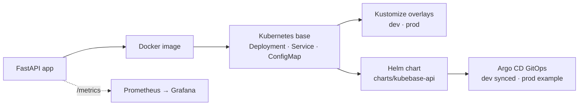

# KubeBase Platform — Architecture

## Purpose

KubeBase Platform is a **local Kubernetes platform lab**. It takes a small
application all the way from source code to running Pods on a cluster, using the
core Kubernetes objects and a clean, Kustomize-based manifest layout. It is a
learning and portfolio project and runs **locally by default** (minikube, kind or
Docker Desktop) — it is not a production platform.

## Overview

```
Source code (FastAPI)  ->  Container image (Dockerfile)  ->  Kubernetes (Kustomize base)
                                                              ├─ Namespace: kubebase-dev
                                                              ├─ ConfigMap  (non-secret config)
                                                              ├─ Secret     (example only)
                                                              ├─ Deployment (2 replicas, probes, limits)
                                                              └─ Service    (ClusterIP :80 -> :8000)
```

## Components

### App

A minimal **FastAPI** service (`app/main.py`) with four endpoints: `/` (info),
`/health` (probe target), `/config` (the non-secret configuration it sees) and
`/metrics` (Prometheus-format metrics — see Observability below). It reads
`APP_NAME`, `APP_ENV`, `APP_GREETING` and `LOG_LEVEL` from environment variables,
with safe defaults so it also runs without any configuration. It never reads or
returns secret values.

### Container image

The [`Dockerfile`](../Dockerfile) builds a single-stage image on `python:3.12-slim`.
It installs the dependencies first (for layer caching), copies the app, runs as a
non-root user (`uid 10001`) and serves the app with `uvicorn` on port `8000`.
Tagged `kubebase-platform:0.1.0` for local use.

### Kubernetes namespace

All objects live in the **`kubebase-dev`** namespace
([`namespace.yaml`](../kubernetes/base/namespace.yaml)). Keeping the project in
its own namespace makes it easy to inspect and to remove cleanly without touching
anything else in the cluster.

### Deployment

[`deployment.yaml`](../kubernetes/base/deployment.yaml) runs **2 replicas** of the
app container. It defines:

- a named `http` port (`8000`),
- `envFrom` the **ConfigMap** so config arrives as environment variables,
- a **readinessProbe** and **livenessProbe** on `/health` (readiness gates
  traffic; liveness restarts a stuck container),
- **resource requests and limits** (`50m`/`64Mi` requested, `200m`/`128Mi`
  limit) so the scheduler can place it and it can't starve the node.

### Service

[`service.yaml`](../kubernetes/base/service.yaml) is a **ClusterIP** Service that
exposes the Deployment inside the cluster on port `80`, forwarding to the
container's `http` (`8000`) port. ClusterIP keeps it internal; for local access
you use `kubectl port-forward` (see operations) — external exposure via Ingress
is on the roadmap.

### ConfigMap

[`configmap.yaml`](../kubernetes/base/configmap.yaml) holds the **non-secret**
configuration (`APP_NAME`, `APP_ENV`, `APP_GREETING`, `LOG_LEVEL`). It is the
single place to change the app's behaviour without rebuilding the image.

### Secret (example only)

[`secret.example.yaml`](../kubernetes/base/secret.example.yaml) shows the **shape**
of a Kubernetes Secret with obvious placeholder values. It is **not** applied by
the Kustomize base and the demo app does not need it. To use a real secret, copy
it to a local, git-ignored `secret.yaml`, fill in your own values and add it to
the kustomization yourself. Real secrets must never be committed.

### Kustomize base

[`kustomization.yaml`](../kubernetes/base/kustomization.yaml) ties the resources
together, pins the `kubebase-dev` namespace and adds a common `part-of` label.
`kubectl kustomize kubernetes/base` renders the full set of manifests; CI runs
exactly this to validate them.

### Observability (Phase 5)

The app exposes a Prometheus-compatible **`/metrics`** endpoint (request count,
request duration, health-check count and `app_info`). The Kubernetes base and the
Helm chart add plain `prometheus.io/scrape` pod annotations so that:

- **Prometheus** can later discover and scrape the app's metrics — with **no**
  Prometheus Operator or CRDs required (the annotations are ignored on a cluster
  without monitoring).
- **Grafana** can later visualise those metrics via PromQL (a generic starter
  dashboard lives in [`observability/grafana/`](../observability/grafana/)).

This is the **Phase 5 observability layer**: the app and manifests are made
*monitoring-ready*, but no Prometheus or Grafana is installed by default. See
[`observability.md`](observability.md) for details.

## CI

A GitHub Actions workflow ([`.github/workflows/ci.yml`](../.github/workflows/ci.yml))
validates the project on every push/PR — **read-only**. It:

- checks Python syntax (`py_compile`) and that required files exist,
- builds the Kustomize **base, dev and prod** with `kubectl kustomize`,
- runs `helm lint` and renders the chart for **default, dev and prod** values,
- structure/parse-checks the GitOps Argo CD `Application` manifests,
- verifies the observability wiring (the `/metrics` route, the `prometheus-client`
  dependency, and that scrape annotations render), and
- validates the Grafana dashboard JSON if present.

It does **not** build/push images, contact a cluster, or deploy anything.

## Delivery progression (Kustomize → Helm → GitOps)

The project deliberately delivers the **same app** through progressively
higher-level tooling — the realistic path a Platform Engineering team follows:



- **Kustomize overlays** (Phase 2) — the base manifests plus `dev`/`prod`
  overlays ([`kubernetes/overlays/`](../kubernetes/overlays/)) that patch config
  and replica count without duplicating the base.
- **Helm chart** (Phase 3) — the same app packaged as a chart
  ([`charts/kubebase-api`](../charts/kubebase-api/)) with `values.yaml` and
  `values-dev.yaml` / `values-prod.yaml` profiles. Helm is the
  packaging/templating path; Kustomize stays as the raw-manifest path. Both
  deploy the same app — don't run both into one namespace at once. The chart's
  example Secret is disabled by default (placeholders only).
- **GitOps / Argo CD** (Phase 4) — `Application` manifests
  ([`gitops/argocd/`](../gitops/argocd/)) deploy the Helm chart declaratively with
  Git as the source of truth. Sync is manual by default. The **dev** Application
  was reconciled locally to **Synced & Healthy**; **prod is example-only** and was
  not applied. See [`gitops.md`](gitops.md).
- **Observability** (Phase 5) — the `/metrics` endpoint, pod scrape annotations
  and a Grafana **starter dashboard** placeholder
  ([`observability/grafana/kubebase-api-dashboard.json`](../observability/grafana/kubebase-api-dashboard.json)),
  generic and safe (no hardcoded Prometheus URL). See [`observability.md`](observability.md).

Planned next (Phase 6):

1. **Ingress + TLS** — expose the Service through an Ingress controller instead of
   `kubectl port-forward`.
2. **A real monitoring stack** — install `kube-prometheus-stack` and import the
   Grafana dashboard, optionally adding a `ServiceMonitor`/`PodMonitor`.
3. **More profiles** — e.g. a `staging` overlay/values set, and per-environment
   image tags.

This mirrors a realistic progression from raw manifests → Kustomize → Helm →
GitOps → observability that platform teams use in practice.
